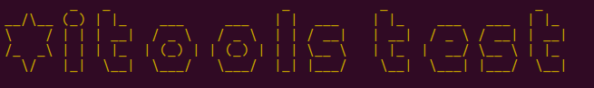
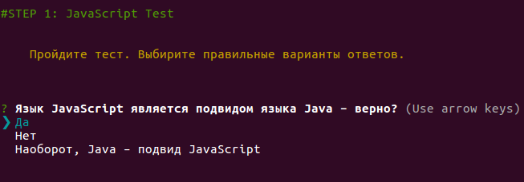
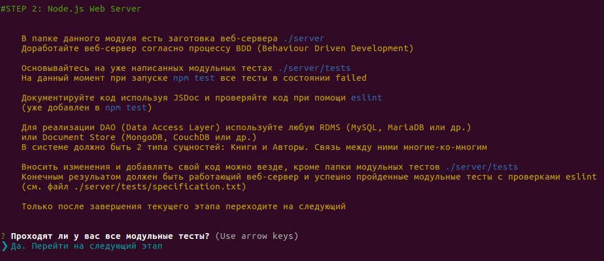
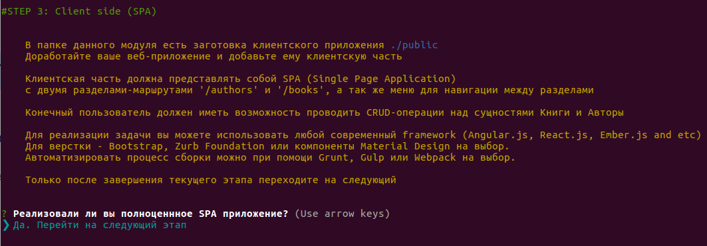
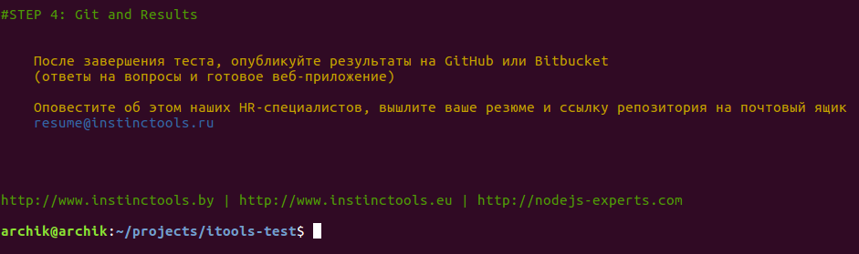

# *itools Full Stack Test



Please, run test via command
```
node itools-candidate-test
```
or
```
node itools-candidate-test/index.js
```
And perform all the tasks step by step

## Step 1. Complete test (RUS language)



## Step 2. Complete server side part of application



## Step 3. Complete client side part of application



## Step 4. Publish your results




You can run specific test step via command
```
node itools-candidate-test --step 2
```
or short form
```
node itools-candidate-test -s 2
```

## License
Copyright (c) 2016 archik
Licensed under the MIT license.